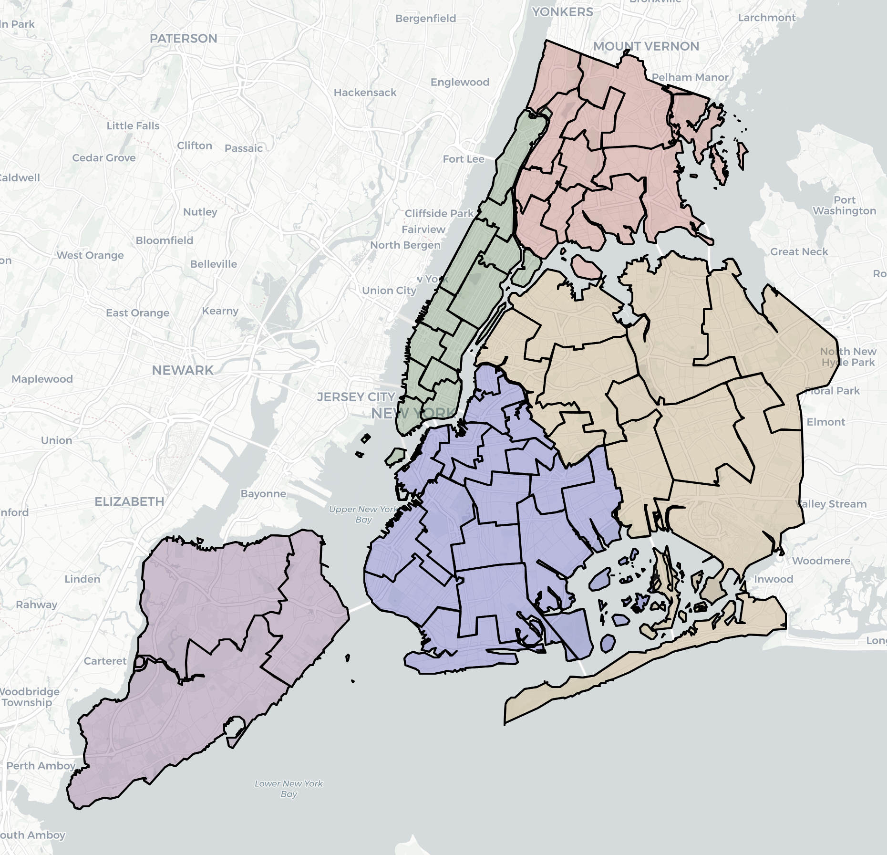
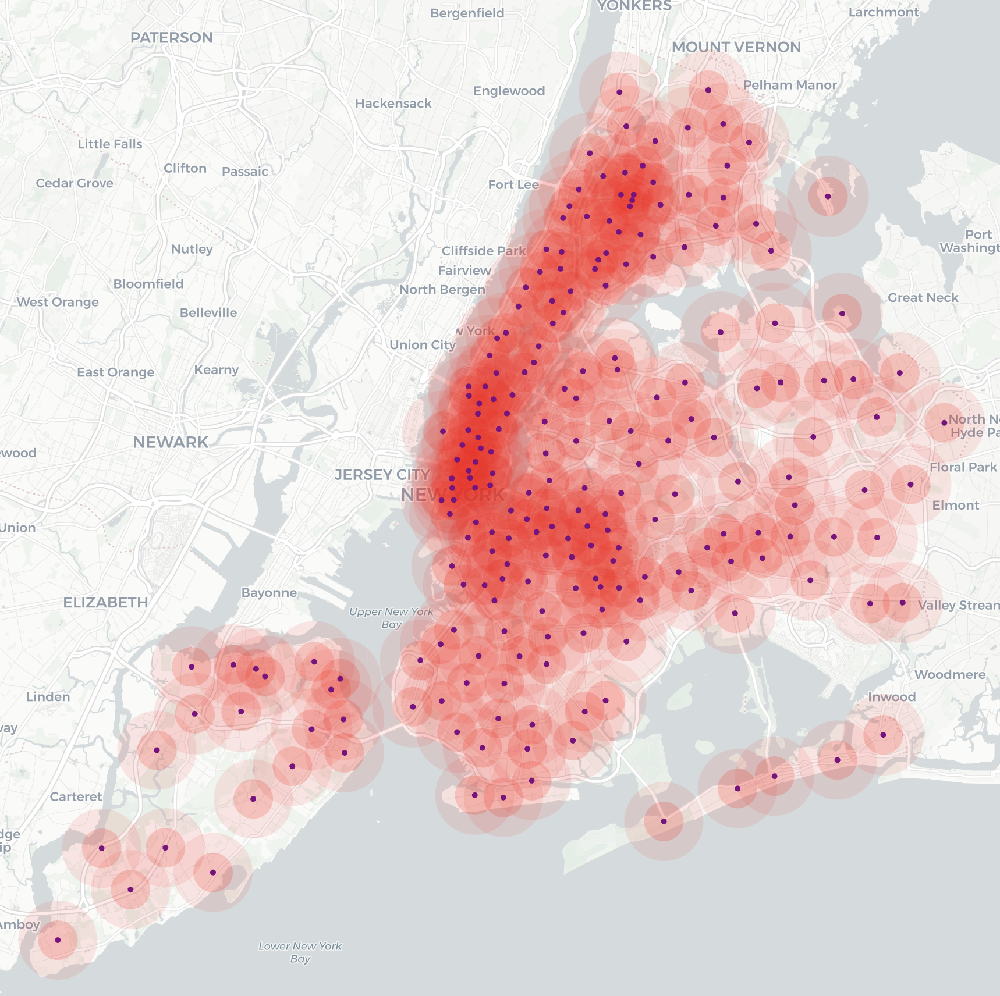
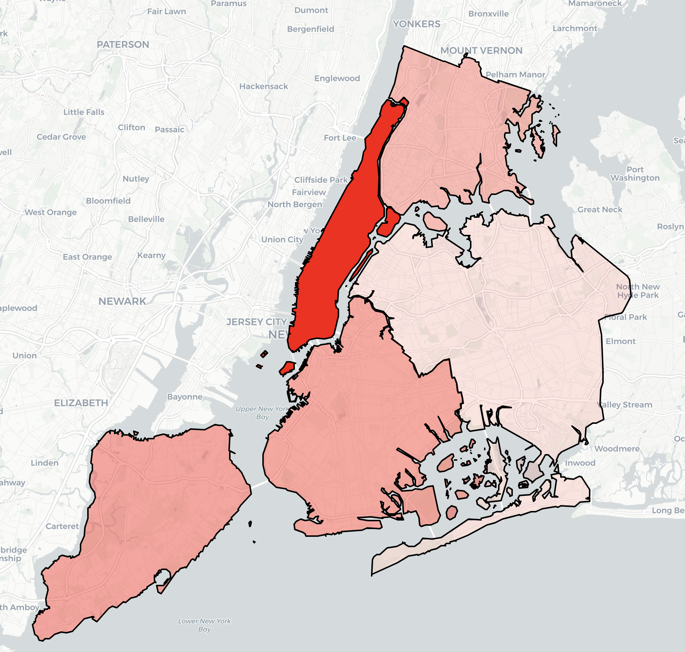
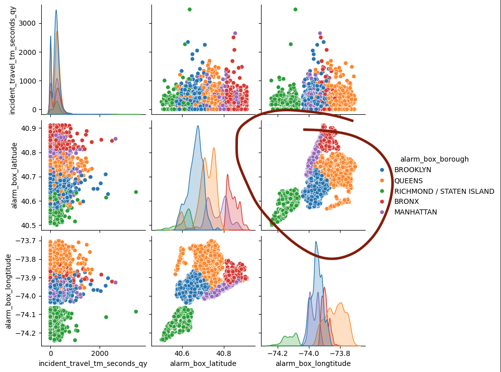

# Emergency AI

## Inhalt
- Problemstellung
- Datenquelle und Auswahl
- Kontext: New York
- Vorbereitung
- Modelltraining und -bewertung
- Practice
- Abschluss & Lessons Learned


[>>> Problemstellung](#problemstellung)

<div style="height: 1000px"></div>

## Problemstellung

### Vorhersage von "Einsatzverläufen"
- Vorhersage der Einsatzdauer
- Bestimmung der benötigten Ressourcen
- Verbesserung der Reaktionszeiten

### Verbesserung der vorhandenen Infrastruktur
- Optimierung der Platzierung von Feuerwachen
- Effiziente Verteilung von Ressourcen
- Reduzierung der Einsatz- und Anfahrtszeiten

[>>> Datenquelle und Auswahl](#datenquelle-und-auswahl)

<div style="height: 1000px"></div>

## Datenquelle und Auswahl

| Typ          | Organisation          | Precision | Size              | Vorteile                     | Nachteile                     | 
| ------------ | --------------------- | --------- | ----------------- | ---------------------------- | ----------------------------- | 
| Web Crawling | Feuerwehr Emmendingen | Einsatz   | ca. 4800     rows | ✅ Genaue Daten              | ❌ Aufwand durch Web Crawling | 
| Data Set     | Feuerwehr Berlin      | Tag       | ca. 2300     rows | ✅ Unterschiedliche Datasets | ❌ Tagesdurchschnitt          |
| Data Set     | Feuerwehr NewYork     | Einsatz   | ca. 10300000 rows | ✅ Genaue Daten              | ❌ Wenig Fach Wissen          |

- [Feuerwehr Emmendingen](https://feuerwehr.emmendingen.de/die-gesamtwehr/einsaetze)
- [Feuerwehr Berlin](https://www.berliner-feuerwehr.de/service/open-data/#:~:text=Weiterf%C3%BChrende%20Informationen-,Offene%20Daten%20der%20Berliner%20Feuerwehr,medizinischen%20Notf%C3%A4llen%20und%20im%20Katastrophenschutz.)
- [Feuerwehr NewYork](https://opendata.cityofnewyork.us/data/)

### Feuerwehr Emmendingen
```json
{
  "id": "190",
  "title": "Person in Not, Türöffnung",
  "type": "Person in Notlage",
  "location": "Emmendingen, Bürkle-Bleiche",
  "lat": "48.10767999376639",
  "lng": "7.859310311439673",
  "start_date": "05.06.2024 19:31",
  "end_date": "05.06.2024 20:07",
  "alerting_device": "Funkmeldeempfänger",
  "incident_lead": "R. Kesselring",
  "personal_strength": "18",
  "vehicles": [
    { 
      "id": "EM 10",
      "name": "Kommandowagen",
      "abbrevation": "KdoW",
    }, { 
      "id": "EM 46",
      "name": "Hilfeleistungslöschfahrzeug 20",
      "abbrevation": "HLF 20",
    }
  ],
  "organizations": ["Feuerwehr Emmendingen", "Rettungsdienst", "Polizei"]
}
```

### Feuerwehr Berlin
```json
{
  "mission_created_date": "2024-01-01",
  "mission_count_all": 2338,
  "mission_count_ems": 1671,
  "mission_count_ems_critical": 1116,
  "mission_count_ems_critical_cpr": 21,
  "mission_count_fire": 564,
  "mission_count_technical_rescue": 68,
  "response_time_ems_critical_mean": 619.754262788365,
  "response_time_ems_critical_median": 589.0,
  "response_time_ems_critical_std": 212.4887495117316,
  "response_time_ems_critical_cpr_mean": 494.3888888888889,
  "response_time_ems_critical_cpr_median": 493.5,
  "response_time_ems_critical_cpr_std": 146.30634214426246,
  "response_time_fire_time_to_first_pump_mean": 578.2311557788945,
  "response_time_fire_time_to_first_pump_median": 545.0,
  "response_time_fire_time_to_first_pump_std": 213.1385042622863,
  "response_time_fire_time_to_first_ladder_mean": 718.5,
  "response_time_fire_time_to_first_ladder_median": 656.0,
  "response_time_fire_time_to_first_ladder_std": 233.1874475916011,
  "response_time_fire_time_to_full_crew_mean": 803.1335000000001,
  "response_time_fire_time_to_full_crew_median": 754.3715,
  "response_time_fire_time_to_full_crew_std": 229.8317858115656,
  "response_time_technical_rescue_mean": 845.0535714285714,
  "response_time_technical_rescue_median": 712.0,
  "response_time_technical_rescue_std": 375.1114462102191
}
```

### Feuerwehr NewYork
```json
{
  "starfire_incident_id": "2100404460110002",
  "incident_datetime": "2021-01-04T00:01:00.000",
  "alarm_box_borough": "MANHATTAN",
  "alarm_box_number": "446",
  "alarm_box_location": "3 AVE & ST. MARKS PL",
  "incident_borough": "MANHATTAN",
  "zipcode": "10003",
  "policeprecinct": "9",
  "citycouncildistrict": "2",
  "communitydistrict": "103",
  "communityschooldistrict": "1",
  "congressionaldistrict": "12",
  "alarm_source_description_tx": "PD Link/Medical",
  "alarm_level_index_description": "Initial Alarm",
  "highest_alarm_level": "First Alarm",
  "incident_classification": "Medical - PD Link 10-91",
  "incident_classification_group": "Medical Emergencies",
  "dispatch_response_seconds_qy": "13",
  "first_assignment_datetime": "2021-01-04T00:01:00.000",
  "first_activation_datetime": "2021-01-04T00:02:00.000",
  "incident_close_datetime": "2021-01-04T00:07:00.000",
  "valid_dispatch_rspns_time_indc": "N",
  "valid_incident_rspns_time_indc": "N",
  "incident_response_seconds_qy": "0",
  "incident_travel_tm_seconds_qy": "0",
  "engines_assigned_quantity": "1",
  "ladders_assigned_quantity": "0",
  "other_units_assigned_quantity": "0"
}
```

> Ich habe mich für das Dataset von New York entschieden, da es eine umfangreiche Datenmenge bietet und zahlreiche Möglichkeiten zur Verknüpfung mit anderen Daten-Sets existieren.

[>>> Kontext: New York](#kontext-new-york)

<div style="height: 1000px"></div>

## Kontext: New York







[>>> Vorbereitung](#vorbereitung)

<div style="height: 1000px"></div>

## Vorbereitung

### Datenbereinigung

```python
from scipy.spatial import cKDTree
import pandas as pd


# Read Fire Incidents
df = pd.read_csv('/Users/loic.doerr/dev/ny-emergency-ai/rawData/fire-incidents/fire-incidents.csv')


# Add Numeric Timestamp
df['incident_datetime'] = pd.to_datetime(df['incident_datetime'])
df['incident_timestamp'] = df['incident_datetime'].astype(int) // 10**9


# Read Alarm Box Locations
box_locations = pd.read_csv('/Users/loic.doerr/dev/ny-emergency-ai/rawData/locations/In-Service_Alarm_Box_Locations_20240605.csv')
box_locations = box_locations[['LOCATION', 'LATITUDE', 'LONGITUDE']]
box_locations = box_locations.rename(columns={'LOCATION': 'alarm_box_location', 'LATITUDE': 'alarm_box_latitude', 'LONGITUDE': 'alarm_box_longtitude'})


# Merge Alarm Box in Fire Incidents
df = df.merge(box_locations, on='alarm_box_location', how='left')


df = df.dropna()


# Read Fire Stations
fire_stations = pd.read_csv('/Users/loic.doerr/dev/ny-emergency-ai/rawData/locations/FDNY_Firehouse_Listing_20240603.csv')
fire_stations = fire_stations[['Latitude', 'Longitude']]
fire_stations = fire_stations.rename(columns={'Latitude': 'nearest_fire_station_latitude', 'Longitude': 'nearest_fire_station_longitude'})
fire_stations = fire_stations.dropna()


# Calculate Nearest Fire Station per incident
fire_station_tree = cKDTree(fire_stations[['nearest_fire_station_latitude', 'nearest_fire_station_longitude']])
distances, nearest_fire_station_indices = fire_station_tree.query(df[['alarm_box_latitude', 'alarm_box_longtitude']], k=1)
nearest_fire_station_coords = fire_stations.iloc[nearest_fire_station_indices][['nearest_fire_station_latitude', 'nearest_fire_station_longitude']].reset_index(drop=True)


# Merge Nearest Fire Station in Fire Incidents
df = pd.concat([df, nearest_fire_station_coords], axis=1)


df = df.dropna()


# Write to CSV
df.to_csv('../preparedData/incidents.csv', index=False)
```

### Korrelationsanalyse

```python
import seaborn as sns

df = pd.read_csv('../preparedData/incidents.csv')

df = df[['incident_travel_tm_seconds_qy', 'engines_assigned_quantity', 'ladders_assigned_quantity', 'other_units_assigned_quantity', 'alarm_box_borough']]

df = df.sample(n=50000)

sns.pairplot(df, hue='alarm_box_borough')
```




[>>> Modelltraining und -bewertung](#modelltraining-und--bewertung)

<div style="height: 1000px"></div>

## Modelltraining und -bewertung

- Linear Regression
- Scikit Learn

### Modelltraining

``` py
from sklearn.model_selection import train_test_split
from sklearn.linear_model import LinearRegression
from sklearn import metrics

features_train, features_test, target_train, target_test = train_test_split(features, target, test_size=0.3, random_state=1) 

model = LinearRegression()
model.fit(features_train, target_train)

target_pred = model.predict(features_test)
mse = metrics.mean_squared_error(target_test, target_pred)
```

### Bewertung
```
mse = 0.36853703486

rmse = 0.48509792825

0.48509792825 / 1.31628 = 0.36853703486

-> ca. 37% Fehlerquote
```

> Bisher leider nicht geschafft ein besseres Ergebnis zu erzielen

[>>> Practice](#practice)

<div style="height: 1000px"></div>

## Practice

- [Korrelationsanalyse](./analytics/correlation.ipynb)
- [Modelltraining](./training/trainModell.ipynb)

[>>> Abschluss & Lessons Learned](#abschluss--lessons-learned)

<div style="height: 1000px"></div>

## Abschluss & Lessons Learned

- Implementierung mit Python
- Erst die Daten genauer analysieren
- Direkt eine Korrelationsanalyse
- Nicht alle Daten sind gut für Machine Learning
- Die Menge an Daten ist nicht unbedingt das entscheidende

> Danke fürs zuhören